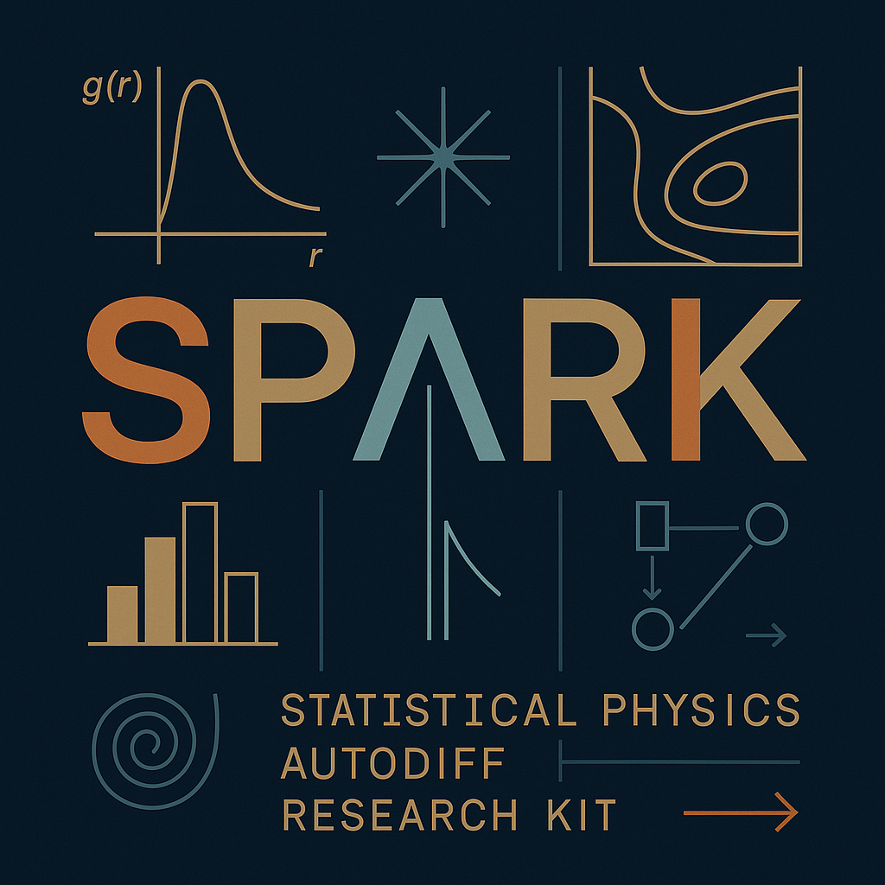

# SPARK: Statistical Physics Autodiff Research Kit

This implements some basic methods for performing MD simulations within pytorch. Functionality will be added as I need it. The goal is to have trivial paralleilzation over parameters of simulations with the batching feature of pytorch. This code is in development and assumed to be buggy, take results with a grain of salt for now.

To install a basic set of packages I used the following
- `mamba create -n spark --override-channels \
  -c conda-forge -c nvidia -c pytorch \
  python=3.10 numpy scipy pandas matplotlib seaborn sympy \
  jupyterlab scikit-learn \
  pytorch torchvision torchaudio pytorch-cuda=11.8 \
  h5py netcdf4 xarray parmed -y
`
  
Activate env
- `conda activate spark`
  
Create ipykernel
- `conda run -n spark python -m ipykernel install --user --name spark --display-name "Python (spark)"`

Logo courtesy of chat. 
